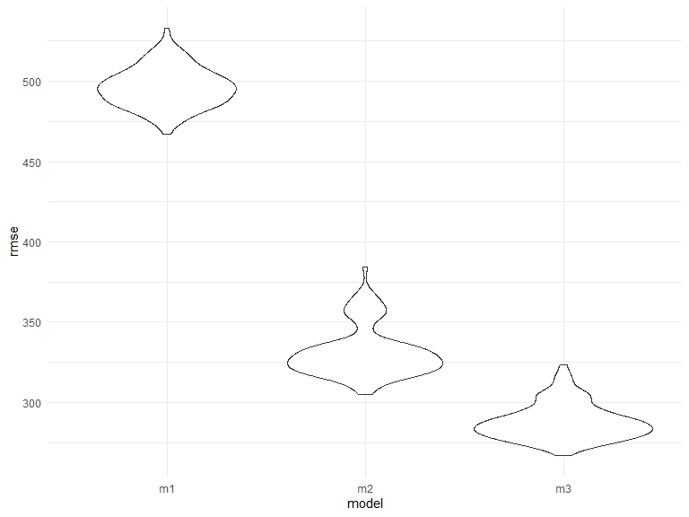

p8105_hw6_wm2460
================

## Problem 1

``` r
weather_df = 
  rnoaa::meteo_pull_monitors(
    c("USW00094728"),
    var = c("PRCP", "TMIN", "TMAX"), 
    date_min = "2017-01-01",
    date_max = "2017-12-31") %>%
  mutate(
    name = recode(id, USW00094728 = "CentralPark_NY"),
    tmin = tmin / 10,
    tmax = tmax / 10) %>%
  select(name, id, everything())
```

## Problem 2

### Tidying the dataset

``` r
homicides_df = read_csv("./data/homicide-data.csv")

homicides_new = homicides_df %>% 
  janitor::clean_names() %>% 
  mutate(city_state = str_c(city, state, sep = "_")) %>% 
  filter(!city_state %in% c("Dallas_TX", "Phoenix_AZ", "Kansas City_MO", "Tulsa_AL"), 
         victim_race %in% c("Black", "White")) %>% 
  mutate(victim_age = as.numeric(victim_age),
         resolved = as.numeric(disposition == "Closed by arrest"),
         victim_race = fct_relevel(victim_race, "White"),
         victim_sex = fct_relevel(victim_sex, "Female"))
```

### `glm` for Baltimore

``` r
baltimore_glm = homicides_new %>% 
  filter(city_state == "Baltimore_MD") %>% 
  glm(resolved ~ victim_age + victim_sex + victim_race, data = ., family = binomial()) %>% 
  broom::tidy()

baltimore_glm
```

    ## # A tibble: 4 × 5
    ##   term             estimate std.error statistic  p.value
    ##   <chr>               <dbl>     <dbl>     <dbl>    <dbl>
    ## 1 (Intercept)       1.15      0.237        4.87 1.14e- 6
    ## 2 victim_age       -0.00673   0.00332     -2.02 4.30e- 2
    ## 3 victim_sexMale   -0.854     0.138       -6.18 6.26e-10
    ## 4 victim_raceBlack -0.842     0.175       -4.82 1.45e- 6

``` r
# save the output of glm as an R object
baltimore_glm = homicides_new %>% 
  filter(city_state == "Baltimore_MD") %>% 
  glm(resolved ~ victim_age + victim_sex + victim_race, data = ., family = binomial()) %>% 
  saveRDS(., "./data/Baltimore_glm.rds")
```

### Odds ratio for Baltimore

``` r
#cannot knit this code chunk
#baltimore_glm %>% 
#  mutate(OR = exp(estimate)) %>%
#  select(term, log_OR = estimate, OR, p.value) %>% 
#  knitr::kable(digits = 3)
```

### `glm` for all cities

``` r
#Draft code
#all_glm = homicides_new %>% 
#  nest(all_cities = c(resolved, victim_age, victim_sex, victim_race)) %>%
#  select(city_state, all_cities) %>% 
#  group_by(city_state) %>% 
#  mutate(models = map(.x = all_cities, ~glm(resolved ~ victim_age + victim_sex + victim_race, data = ., family = binomial())),
#         results = map(models, broom::tidy))#
```

## Problem 3

### Load and clearn

``` r
bw_df = read_csv("./data/birthweight.csv")
```

    ## Rows: 4342 Columns: 20
    ## ── Column specification ────────────────────────────────────────────────────────
    ## Delimiter: ","
    ## dbl (20): babysex, bhead, blength, bwt, delwt, fincome, frace, gaweeks, malf...
    ## 
    ## ℹ Use `spec()` to retrieve the full column specification for this data.
    ## ℹ Specify the column types or set `show_col_types = FALSE` to quiet this message.

``` r
bw_new = bw_df %>% 
  mutate(babysex = as.factor(babysex),
         frace = as.factor(frace),
         malform = as.factor(malform),
         mrace = as.factor(mrace)) 

sum(is.na(bw_new))
```

    ## [1] 0

Cleaned the dataset and there is no missing data since
`sum(is.na(bw_new))` returns 0.

### Model 1

``` r
m1 = lm(bwt ~ wtgain, data = bw_new)

m1_df = bw_new %>% 
  select(bwt, wtgain) %>% 
  modelr::add_residuals(m1) %>% 
  modelr::add_predictions(m1)

m1_df %>% 
  ggplot(aes(x = wtgain, y = resid)) + geom_violin()
```


I picked the variable `wtgain` as the predictor for model 1 and I picked
it based on a hypothesized structure for the factors that underly
birthweight.

The residual plot shows that the residual of `wtgain` is approximately
normally distributed following the central limit theorem.

## Model 2 & 3

``` r
m2 = lm(bwt ~ blength + gaweeks, data = bw_new)

m3 = lm(bwt ~ bhead + blength + babysex + bhead*blength + bhead*babysex + blength*babysex + bhead*blength*babysex, data = bw_new)
```

## Crossvalidation

``` r
bw_cv = crossv_mc(bw_new, 100) %>% 
  mutate(train = map(train, as_tibble),
         test = map(test, as_tibble)) %>% 
  mutate(m1_cv = map(train, ~lm(bwt ~ wtgain, data = .x)),
         m2_cv = map(train, ~lm(bwt ~ blength + gaweeks, data = .x)),
         m3_cv = map(train, ~lm(bwt ~ bhead + blength + babysex + bhead*blength + bhead*babysex + blength*babysex + bhead*blength*babysex, data = .x))) %>% 
  mutate(rmse_m1 = map2_dbl(m1_cv, test, ~rmse(model = .x, data = .y)),
         rmse_m2 = map2_dbl(m2_cv, test, ~rmse(model = .x, data = .y)), 
         rmse_m3 = map2_dbl(m3_cv, test, ~rmse(model = .x, data = .y)))

bw_cv_plot = bw_cv %>% 
  select(starts_with("rmse")) %>% 
  pivot_longer(everything(), 
               names_to = "model",
               values_to = "rmse",
               names_prefix = "rmse_") %>% 
  ggplot(aes(x = model, y = rmse)) + geom_violin()

bw_cv_plot
```



From the violin plot, we can see that model 1 has the highest RMSE and
model 3 has the lowest RMSE. Since it is preferable to select the model
with the smallest RMSE, model 3 is better comparing to the other two
models.
