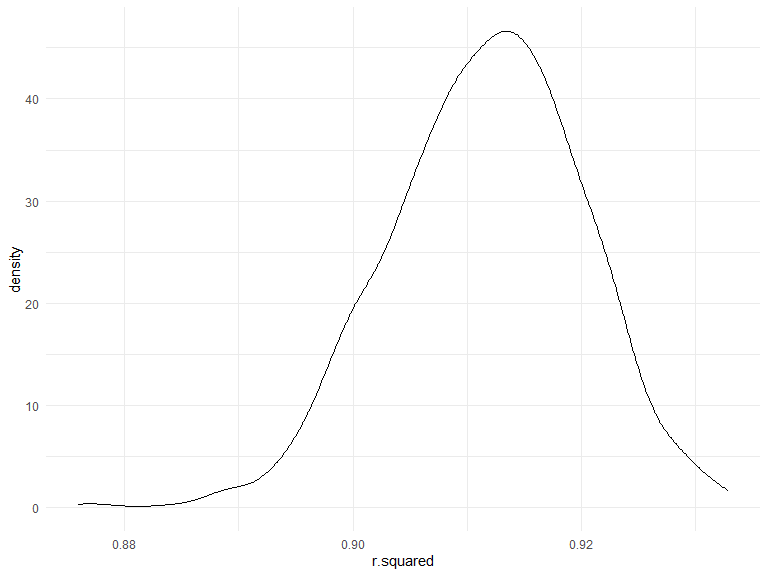

p8105_hw6_wm2460
================

## Problem 1

To obtain a distribution for $\hat{r}^2$, we’ll follow basically the
same procedure we used for regression coefficients: draw bootstrap
samples; the a model to each; extract the value I’m concerned with; and
summarize. Here, we’ll use `modelr::bootstrap` to draw the samples and
`broom::glance` to produce `r.squared` values.

``` r
weather_df = 
  rnoaa::meteo_pull_monitors(
    c("USW00094728"),
    var = c("PRCP", "TMIN", "TMAX"), 
    date_min = "2017-01-01",
    date_max = "2017-12-31") %>%
  mutate(
    name = recode(id, USW00094728 = "CentralPark_NY"),
    tmin = tmin / 10,
    tmax = tmax / 10) %>%
  select(name, id, everything())
```

``` r
weather_df %>% 
  modelr::bootstrap(n = 1000) %>% 
  mutate(
    models = map(strap, ~lm(tmax ~ tmin, data = .x) ),
    results = map(models, broom::glance)) %>% 
  select(-strap, -models) %>% 
  unnest(results) %>% 
  ggplot(aes(x = r.squared)) + geom_density()
```



In this example, the $\hat{r}^2$ value is high, and the upper bound at 1
may be a cause for the generally skewed shape of the distribution. If we
wanted to construct a confidence interval for $R^2$, we could take the
2.5% and 97.5% quantiles of the estimates across bootstrap samples.
However, because the shape isn’t symmetric, using the mean +/- 1.96
times the standard error probably wouldn’t work well.

We can produce a distribution for $\log(\beta_0 * \beta1)$ using a
similar approach, with a bit more wrangling before we make our plot.

``` r
weather_df %>% 
  modelr::bootstrap(n = 1000) %>% 
  mutate(
    models = map(strap, ~lm(tmax ~ tmin, data = .x) ),
    results = map(models, broom::tidy)) %>% 
  select(-strap, -models) %>% 
  unnest(results) %>% 
  select(id = `.id`, term, estimate) %>% 
  pivot_wider(
    names_from = term, 
    values_from = estimate) %>% 
  rename(beta0 = `(Intercept)`, beta1 = tmin) %>% 
  mutate(log_b0b1 = log(beta0 * beta1)) %>% 
  ggplot(aes(x = log_b0b1)) + geom_density()
```


As with $r^2$, this distribution is somewhat skewed and has some
outliers. The point of this is not to say you should always use the
bootstrap – it’s possible to establish “large sample” distributions for
strange parameters / values / summaries in a lot of cases, and those are
great to have. But it is helpful to know that there’s a way to do
inference even in tough cases.

## Problem 2

### Tidying the dataset

``` r
homicides_df = read_csv("./data/homicide-data.csv")

homicides_new = homicides_df %>% 
  janitor::clean_names() %>% 
  mutate(city_state = str_c(city, state, sep = "_")) %>% 
  filter(!city_state %in% c("Dallas_TX", "Phoenix_AZ", "Kansas City_MO", "Tulsa_AL"), 
         victim_race %in% c("Black", "White")) %>% 
  mutate(victim_age = as.numeric(victim_age),
         resolved = as.numeric(disposition == "Closed by arrest"),
         victim_race = fct_relevel(victim_race, "White"),
         victim_sex = fct_relevel(victim_sex, "Female"))
```

### `glm` for Baltimore

``` r
baltimore_glm = homicides_new %>% 
  filter(city_state == "Baltimore_MD") %>% 
  glm(resolved ~ victim_age + victim_sex + victim_race, family = binomial(), data = .) %>% 
  broom::tidy()

baltimore_glm
```

    ## # A tibble: 4 × 5
    ##   term             estimate std.error statistic  p.value
    ##   <chr>               <dbl>     <dbl>     <dbl>    <dbl>
    ## 1 (Intercept)       1.15      0.237        4.87 1.14e- 6
    ## 2 victim_age       -0.00673   0.00332     -2.02 4.30e- 2
    ## 3 victim_sexMale   -0.854     0.138       -6.18 6.26e-10
    ## 4 victim_raceBlack -0.842     0.175       -4.82 1.45e- 6

### Adjusted odds ratio for Baltimore

``` r
baltimore_or = baltimore_glm %>% 
  mutate(OR = exp(estimate),
         CI_lower = exp(estimate - 1.96 * std.error),
         CI_upper = exp(estimate + 1.96 * std.error))

baltimore_or %>%
  filter(term == "victim_sexMale") %>%
  select(term, OR, CI_lower, CI_upper) %>% 
  knitr::kable(digits = 3)
```

| term           |    OR | CI_lower | CI_upper |
|:---------------|------:|---------:|---------:|
| victim_sexMale | 0.426 |    0.325 |    0.558 |

For Baltimore, the adjusted odds ratio for solving homicides comparing
male victims to female victims keeping all other variables fixed is
0.4255117 with 95% CI (0.324559, 0.5578655).

### `glm` and adjusted odds ratio for all cities

``` r
all_glm = homicides_new %>% 
  nest(all_cities = -city_state) %>%
  mutate(models = map(.x = all_cities, ~glm(resolved ~ victim_age + victim_sex + victim_race, family = binomial(), data = .)),
         results = map(models, broom::tidy)) %>% 
  select(-models, -all_cities) %>% 
  unnest(cols = results) %>% 
  mutate(OR = exp(estimate),
         CI_lower = exp(estimate - 1.96 * std.error),
         CI_upper = exp(estimate + 1.96 * std.error)) %>% 
  filter(term == "victim_sexMale") %>% 
  select(city_state, OR, CI_lower, CI_upper)

all_glm %>% 
  knitr::kable(digits = 3)
```

| city_state        |    OR | CI_lower | CI_upper |
|:------------------|------:|---------:|---------:|
| Albuquerque_NM    | 1.767 |    0.831 |    3.761 |
| Atlanta_GA        | 1.000 |    0.684 |    1.463 |
| Baltimore_MD      | 0.426 |    0.325 |    0.558 |
| Baton Rouge_LA    | 0.381 |    0.209 |    0.695 |
| Birmingham_AL     | 0.870 |    0.574 |    1.318 |
| Boston_MA         | 0.674 |    0.356 |    1.276 |
| Buffalo_NY        | 0.521 |    0.290 |    0.935 |
| Charlotte_NC      | 0.884 |    0.557 |    1.403 |
| Chicago_IL        | 0.410 |    0.336 |    0.501 |
| Cincinnati_OH     | 0.400 |    0.236 |    0.677 |
| Columbus_OH       | 0.532 |    0.378 |    0.750 |
| Denver_CO         | 0.479 |    0.236 |    0.971 |
| Detroit_MI        | 0.582 |    0.462 |    0.734 |
| Durham_NC         | 0.812 |    0.392 |    1.683 |
| Fort Worth_TX     | 0.669 |    0.397 |    1.127 |
| Fresno_CA         | 1.335 |    0.580 |    3.071 |
| Houston_TX        | 0.711 |    0.558 |    0.907 |
| Indianapolis_IN   | 0.919 |    0.679 |    1.242 |
| Jacksonville_FL   | 0.720 |    0.537 |    0.966 |
| Las Vegas_NV      | 0.837 |    0.608 |    1.154 |
| Long Beach_CA     | 0.410 |    0.156 |    1.082 |
| Los Angeles_CA    | 0.662 |    0.458 |    0.956 |
| Louisville_KY     | 0.491 |    0.305 |    0.790 |
| Memphis_TN        | 0.723 |    0.529 |    0.988 |
| Miami_FL          | 0.515 |    0.304 |    0.872 |
| Milwaukee_wI      | 0.727 |    0.499 |    1.060 |
| Minneapolis_MN    | 0.947 |    0.478 |    1.875 |
| Nashville_TN      | 1.034 |    0.685 |    1.562 |
| New Orleans_LA    | 0.585 |    0.422 |    0.811 |
| New York_NY       | 0.262 |    0.138 |    0.499 |
| Oakland_CA        | 0.563 |    0.365 |    0.868 |
| Oklahoma City_OK  | 0.974 |    0.624 |    1.520 |
| Omaha_NE          | 0.382 |    0.203 |    0.721 |
| Philadelphia_PA   | 0.496 |    0.378 |    0.652 |
| Pittsburgh_PA     | 0.431 |    0.265 |    0.700 |
| Richmond_VA       | 1.006 |    0.498 |    2.033 |
| San Antonio_TX    | 0.705 |    0.398 |    1.249 |
| Sacramento_CA     | 0.669 |    0.335 |    1.337 |
| Savannah_GA       | 0.867 |    0.422 |    1.780 |
| San Bernardino_CA | 0.500 |    0.171 |    1.462 |
| San Diego_CA      | 0.413 |    0.200 |    0.855 |
| San Francisco_CA  | 0.608 |    0.317 |    1.165 |
| St. Louis_MO      | 0.703 |    0.530 |    0.932 |
| Stockton_CA       | 1.352 |    0.621 |    2.942 |
| Tampa_FL          | 0.808 |    0.348 |    1.876 |
| Tulsa_OK          | 0.976 |    0.614 |    1.552 |
| Washington_DC     | 0.690 |    0.468 |    1.017 |

### Plot for adjusted OR and 95% CI

``` r
or_plot = all_glm %>% 
  mutate(city_state = fct_reorder(city_state, OR)) %>% 
  ggplot(aes(x = city_state, y = OR)) +
  geom_point() +
  ylim(0, 4) +
  geom_errorbar(aes(ymin = CI_lower, ymax = CI_upper)) + 
  theme(axis.text.x = element_text(angle = 90, vjust = 0.5, hjust = 1))

or_plot
```


Here, we can see that New York has the lowest adjusted odds ratio and
Albuquerque has the highest adjusted odds ratio. Many cities have odds
ratio below 1, and this means that the odds of having a resolved
homicide when the victim is male is lower than the odds of having a
resolved homicide when the victim is female in those cities, adjusting
for victim age and victim race.

On the other hand, several cities, such as Nashville, Fresno, Stockton,
and Albuquerque, have odds ratio larger than 1, meaning that the odds of
having a resolved homicide when the victim is male is higher than the
odds of having a resolved homicide when the victim is female, adjusting
for victim age and victim race. Besides, the 95% CI of Fresno, Stockton,
and Albuquerque is much wider than other cities.

## Problem 3

### Load and clearn

``` r
bw_df = read_csv("./data/birthweight.csv")
```

    ## Rows: 4342 Columns: 20
    ## ── Column specification ────────────────────────────────────────────────────────
    ## Delimiter: ","
    ## dbl (20): babysex, bhead, blength, bwt, delwt, fincome, frace, gaweeks, malf...
    ## 
    ## ℹ Use `spec()` to retrieve the full column specification for this data.
    ## ℹ Specify the column types or set `show_col_types = FALSE` to quiet this message.

``` r
bw_new = bw_df %>% 
  mutate(babysex = as.factor(babysex),
         frace = as.factor(frace),
         malform = as.factor(malform),
         mrace = as.factor(mrace)) 

sum(is.na(bw_new))
```

    ## [1] 0

Cleaned the dataset and there is no missing data since
`sum(is.na(bw_new))` returns 0.

### Model 1

``` r
m1 = lm(bwt ~ wtgain, data = bw_new)

m1_df = bw_new %>% 
  select(bwt, wtgain) %>% 
  modelr::add_residuals(m1) %>% 
  modelr::add_predictions(m1)

m1_df %>% 
  ggplot(aes(x = wtgain, y = resid)) + geom_violin()
```


I picked the variable `wtgain` as the predictor for model 1 and I picked
it based on a hypothesized structure for the factors that underly
birthweight. It is possible that mother’s weight gain during pregnancy
is closely related to baby’s birth weight. If the mother gain more
weight, perhaps the baby’s birth weight is heavier.

The residual plot shows that the residual of `wtgain` is approximately
normally distributed and there are not any notable outliers from the
residual plot.

## Model 2 & 3

``` r
m2 = lm(bwt ~ blength + gaweeks, data = bw_new)

m3 = lm(bwt ~ bhead + blength + babysex + bhead*blength + bhead*babysex + blength*babysex + bhead*blength*babysex, data = bw_new)
```

## Crossvalidation

``` r
bw_cv = crossv_mc(bw_new, 100) %>% 
  mutate(train = map(train, as_tibble),
         test = map(test, as_tibble)) %>% 
  mutate(m1_cv = map(train, ~lm(bwt ~ wtgain, data = .x)),
         m2_cv = map(train, ~lm(bwt ~ blength + gaweeks, data = .x)),
         m3_cv = map(train, ~lm(bwt ~ bhead + blength + babysex + bhead*blength + bhead*babysex + blength*babysex + bhead*blength*babysex, data = .x))) %>% 
  mutate(rmse_m1 = map2_dbl(m1_cv, test, ~rmse(model = .x, data = .y)),
         rmse_m2 = map2_dbl(m2_cv, test, ~rmse(model = .x, data = .y)), 
         rmse_m3 = map2_dbl(m3_cv, test, ~rmse(model = .x, data = .y)))

bw_cv_plot = bw_cv %>% 
  select(starts_with("rmse")) %>% 
  pivot_longer(everything(), 
               names_to = "model",
               values_to = "rmse",
               names_prefix = "rmse_") %>% 
  ggplot(aes(x = model, y = rmse)) + geom_violin()

bw_cv_plot
```


From the violin plot, we can see that model 1, which is the model I
proposed, has the highest RMSE and model 3 has the lowest RMSE. Since it
is preferable to select the model with the smallest RMSE, model 3 is
better comparing to the other two models.

## End of HW6
